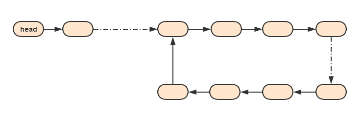
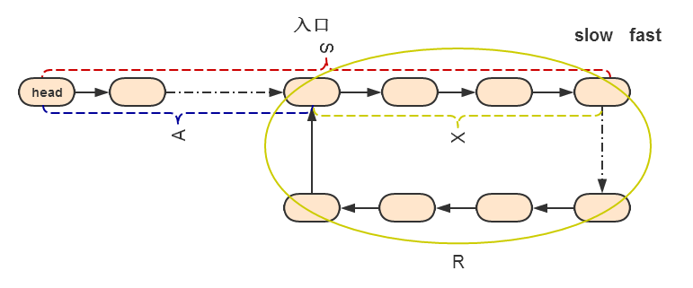

# 有关单链表存在环的相关问题

[完整代码](../../../col-core/src/main/java/com/sl/coljourney/datastruct/linked/LoopLinked.java)

## 1.概述
有关单链表存在环相关的问题比较经典，也是在面试中容易被问到的问题。在讨论这些问题前先简要的介绍一下链表的概念。

   > 单链表：单链表是一种链式存取的数据结构，用一组地址任意的存储单元存放线性表中的数据元素。每个结点的构成：元素(数据元素
   的映象) + 指针(指示后继元素存储位置)，元素就是存储数据的存储单元，指针就是连接每个结点的地址数据。

在一个单向链表，链表当中有可能出现环，如下图：<br>



## 2.相关的一些问题
 * 问题一：如何判断一个单链表中是否存在环？
 * 问题二：如果此单链表存在环，那么求环的入口节点？
 * 问题三：如果此单链表存在环，那么求环的长度？
 * 问题四：如果此单链表存在环，那么求链表的长度？
 * 问题五：如何判断两个无环链表是否相交？
 * 问题六：如果两个无环链表相交，求出第一个相交的节点？
 * 问题七：求出环上距离任意一个节点最远的点（也就是对面节点）？
 
## 3.解决思路
1. 借助于Map实现：
    *  首先，先创建一个用于存储节点的Map集合。
    *  然后遍历单链表，每次遍历都去与Map中存储的key进行对比，如果已存在则表示链表存在环，否则存进Map，然后继续遍历，直到最后一个节点。
    *  至于其他的几个问题，用这种方式也能计算出来。
    *  其空间复杂度可以理解为O(N)，时间复杂度可以理解为O(N)。
    
2. 使用快慢指针的方式实现：
    *  其实现原理类似于，在环形跑道上有两个运动员跑步。A运动员跑的慢，B运动员跑的快，在经过N（N >= 1）圈后，B运动员一定会
    追上A运动员。同样，在链表中创建两个指针slow和fast，slow一次一步，fast一次两步，如果slow和fast相遇则说明链表存在环。
    *  本文以快慢指针实现，下面讨论以上7个问题的实现。
    
## 4.如何判断一个单链表中是否存在环？

*  实现思路：
   *  创建两个指针，slow和fast先指向head节点。
   *  slow每次走一步即slow.next，而fast每次走两步fast.next.next，如果slow与fast指针指向了同一个节点，那么说明链表是存在环的。
   *  如果slow指针为空或fast指针为空或fast.next为空，则表示链表遍历完毕且不存在环。

*  Java代码实现：
```
    public boolean isLoopLinked(SingleLinkedList list) {
        SingleLinkedList.Node slow = list.getHead();
        SingleLinkedList.Node fast = slow;
        while (slow != null && fast != null && fast.next != null) {
            slow = slow.next;
            fast = fast.next.next;
            if (slow == fast) {
                return true;
            }
        }
        return false;
    }
```
## 5.如果此单链表存在环，那么求环的入口节点？
求环的入口节点，个人认为比较复杂，也是几个问题中比较关键的一个问题，下面会详细讨论到。
 * 先给出结论：从开始节点到入口的步数和从快慢指针相遇点到入口的步数相等。
 * Java代码实现：<br>
 当slow和fast指针相遇时，表示该单链表存在环。然后将fast指针指向head节点，fast指针和slow指针一次走一步，当他们再次相遇的
 节点即为环的入口点。
```
  public SingleLinkedList.Node loopLinkedEnter(SingleLinkedList list) {
          SingleLinkedList.Node slow = list.getHead();
          SingleLinkedList.Node fast = slow;
          while (slow != null && fast != null && fast.next != null) {
              slow = slow.next;
              fast = fast.next.next;
              if (slow == fast) {
                  fast = list.getHead();
                  while (slow != fast) {
                      slow = slow.next;
                      fast = fast.next;
                  }
                  return slow;
              }
          }
          return null;
      }
```
 * 求证过程：
     * 如下图所示，为一个带环的单链表
     
     * 如图所示，假设：
       * slow指针走过的步数为：S
       * 从head到入口点的步数为：A
       * 从入口到相遇点的步数为：X
       * 环的长度为：R
       * fast指针在与slow相遇时，在环中走的圈数为：N
       * 链表的总长度为：L <br><br>
     1. 如图所示，则 <br>
       * fast指针走过的步数为：2S。（因为slow走一步，fast走两步）<br>
       * 推算出：2S = S + N * R <br>
       * 因此 S = N * R 
     2. 如图所示，从head到相遇点距离S等于head到入口的步数加上从入口到相遇点的距离，即：S = A + X
     3. 通过以上可知：A + X = N * R <br> 
        等价于：A + X = （N - 1）* R + R <br><br>
     4. 如图所示，环的长度R等于链表总长度L减去从head到入口点的长度。即：R = L - A
     5. 通过以上可知道：A + X = （N - 1）* R +（L – A）<br>
         等价于：A = （N - 1）* R +（L – A – X）<br><br>
     6. 最终结果为：A = （N - 1）* R +（L – A – X）<br><br>
        
     * 根据最终结果，以及上图中可得到两点：
        1. （L – A – X）的结果为相遇点到环入口的位置。
        2. 而（N - 1）* R，无论N为多少，R为环的长度，从相遇点开始走（N - 1）* R步数，其最后的点还是在相遇点。换句话说，
        从相遇点开始，在环中无论走多少圈，最终还是会回到当前点；<br><br>
     * 因此等价于：A = L – A – X。也就是说，A代表的是“从head到入口点的步数”，（L – A – X）的结果是“相遇点到环入口的位置”，
     他们是相等的。<br><br>
     * 最终结论：从head点到入口的步数等于从相遇点到入口的步数。也就是说，一个指针从head节点开始一次走一步，另外一个指针从相遇点开始一次走一步，他们相遇的节点即为环的入口节点。
    
## 6.如果此单链表存在环，那么求环的长度？
* 实现思路：建立在通过快慢指针判断链表是否存在环基础上，如果存在环则会有一个相遇点，让其中的一个指针一次走一步，直到再回
到相遇点所经过的步数就是环的长度。
* Java代码实现：
```
 public int loopLinkedLength(SingleLinkedList list) {
        SingleLinkedList.Node slow = list.getHead();
        SingleLinkedList.Node fast = slow;
        while (slow != null && fast != null && fast.next != null) {
            slow = slow.next;
            fast = fast.next.next;
            if (slow == fast) {
                slow = slow.next;
                int length = 1;
                while (slow != fast) {
                    slow = slow.next;
                    length++;
                }
                return length;
            }
        }
        return 0;
    }
```
## 7.其他的问题
* 问题四：如果此单链表存在环，那么求链表的长度？<br><br>
  经过前面的3个问题，这个问题就很简单能计算出来。链表的长度等于环的长度加上开始点到入口点的长度。<br><br>
* 问题五：如何判断两个无环链表是否相交？<br>
  问题六：如果两个无环链表相交，求出第一个相交的节点？<br><br>
  可以将其中一个链表首尾相连，然后在判断另外一个链表是否存在环，如果存在环那么表示两个链表相交。<br>
  相交的点就是环的入口点，也就转化为问题二。<br><br>
* 问题七：求出环上距离任意一个节点最远的点（也就是对面节点）？<br>
  这个问题同样可以使用快慢指针实现；从换上任意一点开始，如：nodeA；slow一次走一步，fast一次走两步。<br>
  当fast = nodeA 或者 fast = nodeA.next的时候，这时slow所在的节点（nodeZ）就是nodeA在环上距离最远的点。<br><br>
  求证如下：
   * 设环的长度为R。
   * 当fast = nodeA 或者 fast = nodeA.next的时候；也就是fast指针刚好走完了环的长度R。
   * 由于fast一次走的是slow的两倍，因此，slow刚好走到环的R/2个节点，也就是在环上对面的节。
  
<br><br>
END
   

     
     


